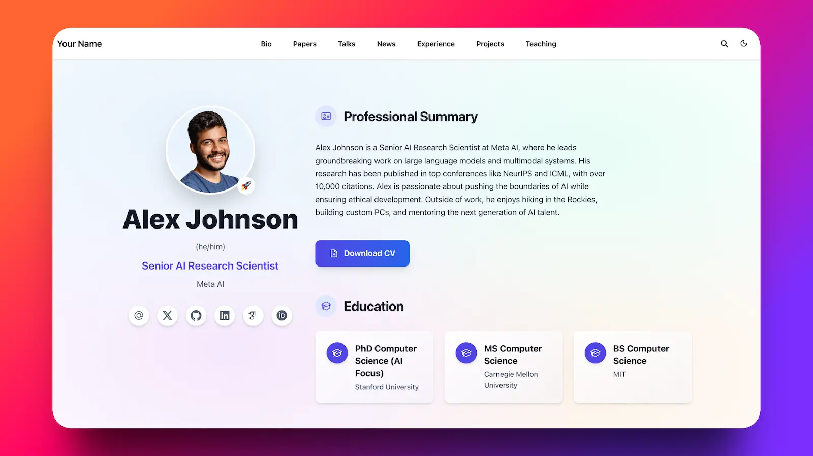

# 신서현 | 포트폴리오

  

  안녕하세요. 백엔드 개발자로 성장하고 있는 신서현입니다. 
  이 레포지토리는 저의 개인 포트폴리오 웹사이트의 소스코드입니다.

  
  

---

## 👨‍💻 About Me

안녕하세요. 저는 전북대학교 컴퓨터인공지능학부에서 공부하며 **백엔드 개발자**로 성장하기 위해 노력하고 있습니다.

서버 및 데이터베이스 설계, API 구축, 클라우드 인프라에 관심이 많으며, AI 기술을 실제 서비스와 융합해 가치 있는 솔루션을 만드는 것을 목표로 하고 있습니다. 끊임없는 학습을 통해 신뢰할 수 있는 백엔드 엔지니어로 나아가겠습니다.

## ✨ My Development Philosophy

제가 개발자로서 지키고자 하는 세 가지 원칙입니다.

> **보이지 않는 곳에서 신뢰를 쌓습니다.** > 기초가 튼튼한 코드는 무너지지 않는다는 믿음으로 개발합니다.

> **빠른 해결보다 바른 해결을 지향합니다.** > 현상 너머의 근본적인 원인을 고민하며 더 나은 구조를 탐색합니다.

> **코드는 정직하게, 배움은 꾸준하게.** > 어제의 코드보다 나은 코드를 만들기 위해 매일 배우고 기록합니다.

## 🛠️ Tech Stack

이 포트폴리오 웹사이트는 아래 기술들을 기반으로 제작되었습니다.

* **Framework**: [Hugo](https://gohugo.io/)
* **Theme**: [Hugo Blox - Academic CV Theme](https://github.com/HugoBlox/theme-academic-cv)
* **Deployment**: [GitHub Pages](https://pages.github.com/)

## 📫 Contact

* **GitHub**: `https://github.com/imsh429`
* **Email**: `sh99429@naver.com`

---

## 🙏 Acknowledgments

이 포트폴리오는 멋진 Hugo 테마를 만들어준 [George Cushen](https://georgecushen.com)과 Hugo Blox 팀 덕분에 만들 수 있었습니다.

## 📄 License

MIT © 2025 Shin Seohyun